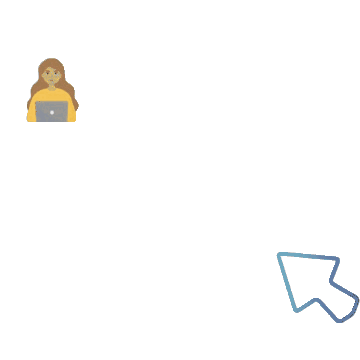
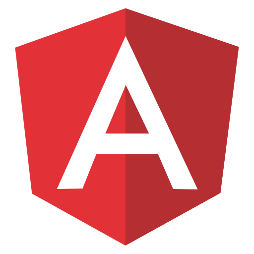

    

<h1 align="center">Hi , I'm Angie</h1>
<h3 align="center">A passionate frontend developer from Colombia </h3>

I have always been passionate about the world of technology and creating new projects. My experience in direct contact with users allowed me to develop my empathy, assertive communication and active listening to find optimal solutions to their needs. My goals are to apply my knowledge and skills in web programming, to grow professionally, to learn autonomously and from others, to share my learning. 

<h3 align="left">Connect with me:</h3>

   
  

- 📚👀 I’m currently learning **React and SQL**.

- 🗽💭 I continue to strengthen my **English level**.

- 🫱🏼‍🫲🏼📈 I like to work on team projects.

<h3 align="left">Languages and Tools:</h3>

 
  
  
  
  
 
 
 
  
 
  

